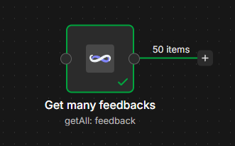

# @continuumtracker/n8n-nodes-continuum-tracker

This is an n8n community node. It lets you interact with the [Continuum Tracker](https://www.continuumtracker.com) public API from your n8n workflows.

**Continuum Tracker** is an AI-powered platform that helps product teams prioritize features by analyzing customer feedback and market data to inform strategic product development decisions. It automates feedback collection from multiple sources, clusters it into themes, and drives backlog prioritization based on market intelligence — built for product managers, investment funds and software agencies that need data-driven decision support.

[n8n](https://n8n.io/) is a [fair-code licensed](https://docs.n8n.io/sustainable-use-license/) workflow automation platform.

- [Installation](#installation)
- [Operations](#operations)
- [Credentials](#credentials)
- [Usage](#usage)
- [Resources](#resources)

## Installation

Follow the [official installation guide](https://docs.n8n.io/integrations/community-nodes/installation/) for n8n community nodes.

**Quick install (self-hosted n8n):**

1. In n8n, go to **Settings → Community nodes**.
2. Click **Install**.
3. Enter the package name: `@continuumtracker/n8n-nodes-continuum-tracker`.
4. Agree to the risks of using community nodes and click **Install**.

After the install completes the **Continuum Tracker** node appears in the nodes panel.

> **Note:** Community nodes are only available on self-hosted n8n instances. They are not available on n8n Cloud unless approved by n8n.

## Operations

The node exposes the following resources and operations:

- **Feedback**
  - Get Many — list feedbacks for a project (paginated, filterable)
  - Get — fetch a single feedback by ID (optionally with embedded painpoints)
  - Create — create a new feedback
  - Update — update an existing feedback
  - Archive — archive (soft-delete) a feedback
- **Signal**
  - Get Many — list signals for a project (paginated, filterable)
  - Get — fetch a single signal by ID
  - Create — create a manual signal
- **Me**
  - Get — get the currently authenticated user

## Credentials

You need a Continuum Tracker API key to use this node.

1. Sign in to [Continuum Tracker](https://app.continuumtracker.com).
2. Go to **Settings → Access** (`/settings/access`).
3. **Generate** a new API key (or rotate an existing one) and copy it.
4. In n8n, create new credentials of type **Continuum Tracker API** and paste the key into the **Access Token** field.

Authentication is sent as a bearer token in the `Authorization` header on every request.

## Usage

A typical workflow: continuously pull customer feedback from a product-management tool like Productboard, Intercom, Zendesk or a typeform survey, and push it into Continuum Tracker so the AI engine can cluster it into themes and prioritize the backlog.

1. **Trigger** — Productboard / Intercom / Zendesk webhook or a Schedule Trigger that polls the source every N minutes.
2. **Source node** — fetch new feedback items (e.g. *Productboard → Get Notes*, *Intercom → List Conversations*).
3. **Set / Edit Fields** — map the source fields onto Continuum Tracker's shape: `feedback_original` (the raw text), optional `name`, `author`, `author_type`, `source` (e.g. `"Productboard"`, `"Intercom"`).
4. **Continuum Tracker** — Resource: `Feedback`, Operation: `Create`, Project: pick from list. Feeds the item into Continuum Tracker, which will automatically cluster it and turn it into prioritization signals.

Tips:

- For *Get Many* operations, toggle **Return All** to auto-paginate through every page; otherwise use **Limit** to cap the result count.
- The node strips the paginator envelope and returns feedback/signal items directly, one item per n8n item.
- The **Me** operation is useful as a credential health-check or to look up the authenticated organization context.

## Resources

- [Continuum Tracker website](https://www.continuumtracker.com)
- [n8n community nodes documentation](https://docs.n8n.io/integrations/#community-nodes)
- [CHANGELOG](CHANGELOG.md)
